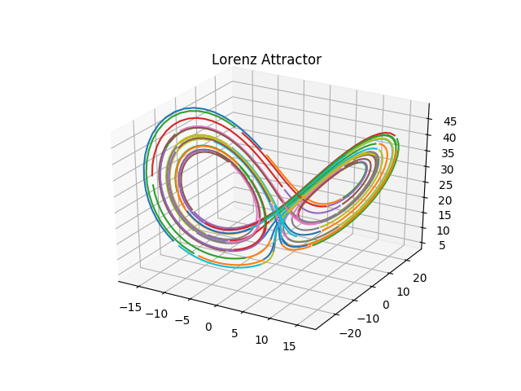

# Traj2Phase

*Recovering the phase space of a dynamical system from broken pieces of trajectories*

## MSSD Bifiltration

Consider a list of $m$ trajectories of length $n$, $\{(x_i[1], x_i[2], ..., x_i[n])\}, i = 1,...,m$, such that each trajectory is a regular sampling of 
a set of flow lines on a topological space $X$. The objective of this project is to recover the topology of $X$ from this set of trajectories. The main 
tool we use here is the following bifiltration on the parameter set $\mathbb{R_+} \times [n]$, which we refer to as the *MSSD (Matching SubString Distance)
bifiltration*.

For each $(\epsilon, t) \in \mathbb{R_+}\times[n]$, define $\mathcal{G}(\epsilon, t)$ as the graph with vertices $[m]$, and an edge $(i, j)$ if the trajectories
$x_i[\cdot]$ and $x_j[\cdot]$ have subtrajectories of length greater than $t$ such that they stay within distance $\epsilon$, i.e

$[m] = V\left(\mathcal{G}(\epsilon, t) \right), \quad (i, j) \in E\left(\mathcal{G}(\epsilon, t) \right) \text{ if }\exists s_1, s_2$ such that $d(x_i[s_1 + s], x_j[s_2+s]) < \epsilon$ for $s=0,..,t-1$.

 The MSSD bifiltration $X(\epsilon, t)$ is then defined as the Vietoris-Rips complex of $\mathcal{G}(\epsilon, t)$: $\quad X(\epsilon, t) = \mathcal{VR}(\mathcal{G}(\epsilon, t))$.

 Our proposition is that the Persistent homology of the MSSD bifiltration contains significant information about the topology of $X$, and this is confirmed
 in the low dimensional example notebooks in [examples/](examples/) and the images in the *Low dimensional examples* section below.

## Installation

### Package Requirements

Install the following packages

`pip install gudhi dtw-python scipy scikit-tda alive_progress`

### Setup

Add the src directory to PYTHONPATH using the command

`source setup.sh`
 
 The notebooks in the [examples/](examples/) folder can now be run.

## Low dimensional examples

Flow lines            |  Phase space homology
:-------------------------:|:-------------------------:
 |  
 |  
 |  
 |  
 |  
 |  
