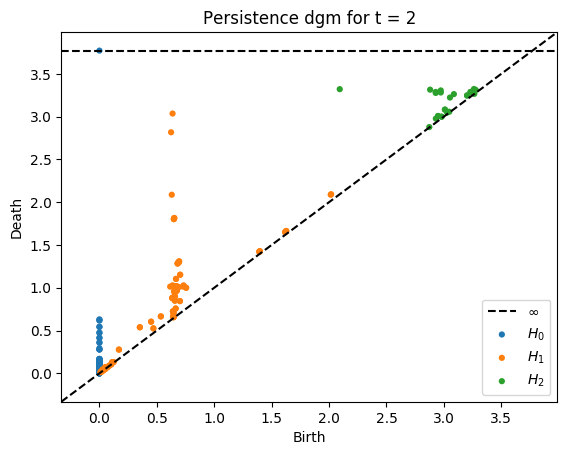
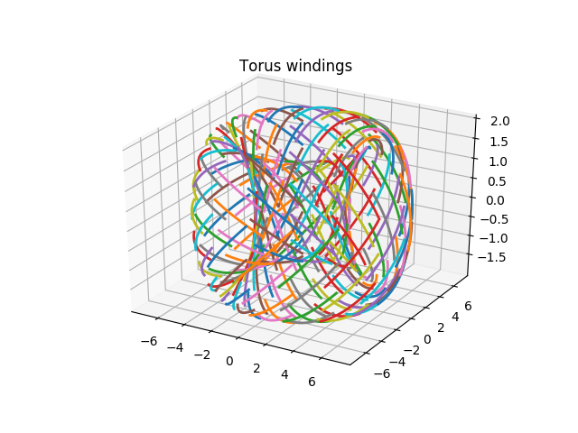
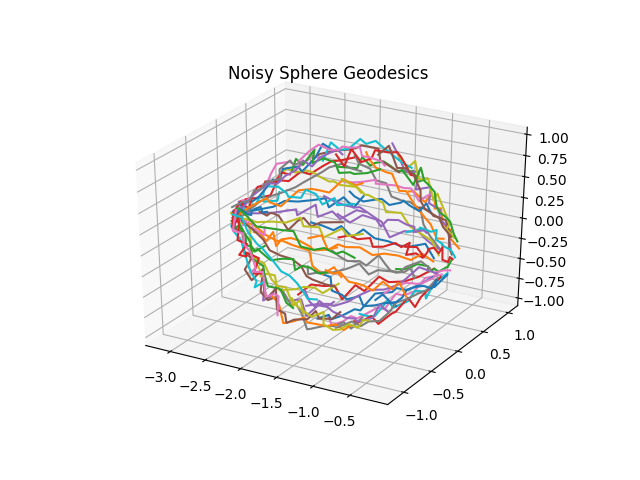

# Traj2Phase

Recovering the phase space of a dynamical system from broken pieces of trajectories

## Package Requirements

Install the following packages

`pip install gudhi dtw-python scipy scikit-tda alive_progress`

## Setup

Add the src directory to PYTHONPATH using the command

`source setup.sh`

## Example results

Flow lines            |  Phase space homology
:-------------------------:|:-------------------------:
 |  
 |  
 |  
 |  
